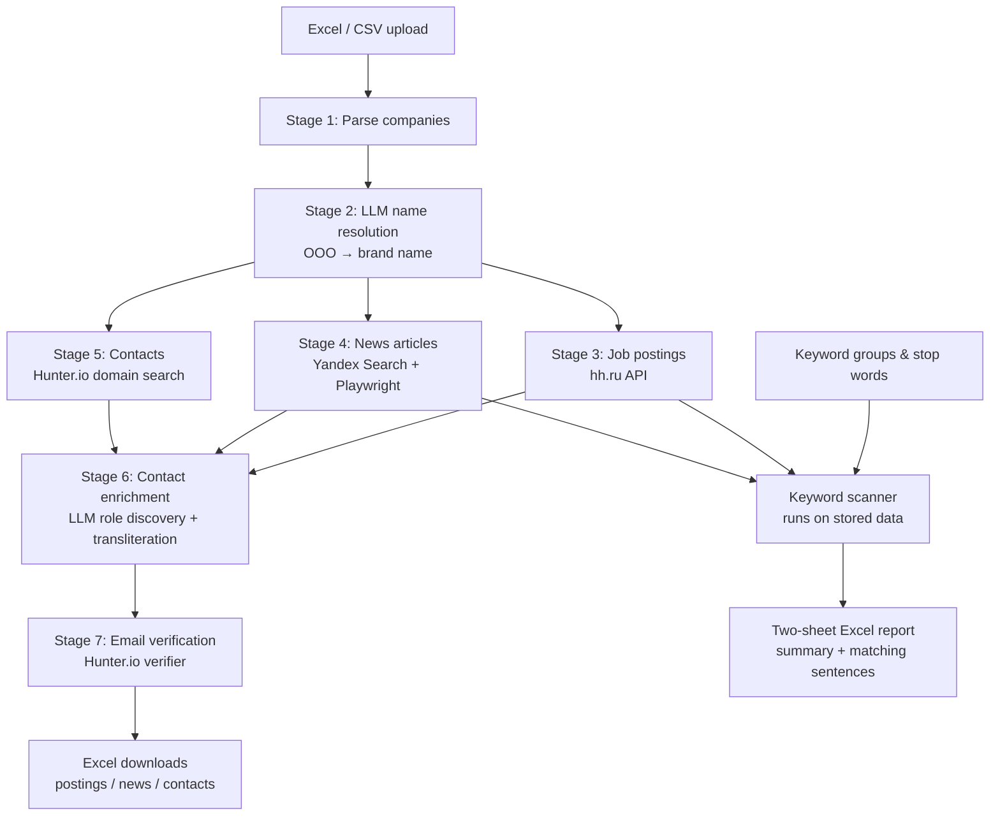

# WEI ABM Platform

B2B account intelligence pipeline for the Russian market. Upload a spreadsheet of companies and get back enriched data: job vacancies, news articles, verified contacts, and keyword signals — ready for sales and marketing teams.

---

## For Non-Technical Readers

The platform takes a raw list of Russian companies (Excel or CSV) and automatically researches each one across multiple data sources. Within hours you get a structured report with:

- **Who is hiring and for what roles** — pulled from hh.ru job postings
- **What is in the news about them** — articles fetched via Yandex Search
- **Who to contact** — verified email addresses from Hunter.io, supplemented by LLM-inferred contacts for target roles
- **Keyword signals** — which companies mention your priority topics (e.g. "ERP", "Cloud Migration", "Digital Transformation") in their postings or news

The platform tracks progress stage by stage and can resume from any point if something fails. Results are downloaded as Excel files.

---

## Pipeline Architecture



---

## Pipeline Stages

| # | Stage | Data Source | What It Produces |
|---|-------|-------------|-----------------|
| 1 | **Parse** | Uploaded file | Company records with `legal_name`, `inn`, `kpp`, `ogrn`, `website_url`, `ceo_name`, `revenue` |
| 2 | **Name resolution** | OpenAI `gpt-4o-mini` | Brand name appended to `known_names[]`; retries with exponential backoff |
| 3 | **Job postings** | hh.ru API (OAuth 2.0) | Vacancies with title, region, salary, requirements, responsibilities; up to 2,000 per name |
| 4 | **News articles** | Yandex Search XML + Playwright | Article title, snippet, date, full body (≤50k chars); concurrent scraping with optional proxy support |
| 5 | **Contacts** | Hunter.io domain search | Employees with email, position, seniority, LinkedIn, confidence score |
| 6 | **Contact enrichment** | OpenAI + GOST transliteration | Probable emails for `target_roles` inferred from detected email pattern |
| 7 | **Email verification** | Hunter.io verifier | Delivery status, SMTP signals, score written back to each contact |

All stages write progress counters (`*_done` / `total_*`) to the database so the UI shows live progress and can resume from exactly where it stopped.

---

## Keyword Intelligence

Keyword scanning is decoupled from the ingestion pipeline and can be re-run at any time without re-fetching external data.

**How it works:**

1. Define **keyword groups** (e.g. "ERP Systems") with individual keywords inside each group
2. Optionally define **stop words** to exclude publications that match them entirely
3. Start a scan — it searches all stored postings and news for the project, deduplicating companies by INN
4. Download a two-sheet Excel:
   - **Summary sheet** — one row per company, one column per keyword, cell = match count, plus group totals
   - **Details sheet** — one row per company × keyword with all matching sentences, source type, and article title

The scan runs as a background job; the frontend polls a status endpoint and enables download when complete.

---

## Tech Stack

| Layer | Technology |
|-------|-----------|
| Web framework | FastAPI + Uvicorn |
| Templating | Jinja2 |
| Database | Supabase (PostgreSQL via REST SDK) |
| LLM | OpenAI `gpt-4o-mini` |
| Job search | hh.ru API (OAuth 2.0 client credentials) |
| Web search | Yandex Search API v2 (XML/base64) |
| Web scraping | Playwright (Chromium, async) |
| Email discovery & verification | Hunter.io |
| Data processing | pandas, openpyxl, BeautifulSoup |
| Language | Python 3.11 |
| Containerisation | Docker |
| Hosting | Amvera |

---

## External Services

You need API credentials for all of the following:

| Service | Env var(s) | Purpose |
|---------|-----------|---------|
| Supabase | `SUPABASE_URL`, `SUPABASE_KEY` | Database |
| OpenAI | `OPENAI_API_KEY` | Name resolution, contact enrichment |
| hh.ru | `HH_CLIENT_ID`, `HH_CLIENT_SECRET` | Job vacancy search |
| Yandex Search | `YANDEX_SEARCH_API_KEY`, `YANDEX_FOLDER_ID` | News article search |
| Hunter.io | `HUNTER_API_KEY` | Email discovery + verification |

Optional:

| Env var | Default | Purpose |
|---------|---------|---------|
| `OPENAI_MODEL` | `gpt-4o-mini` | Override the LLM model |
| `PLAYWRIGHT_CONCURRENCY` | `4` | Parallel browser pages for scraping |
| `PLAYWRIGHT_TIMEOUT_MS` | `20000` | Per-page timeout in milliseconds |
| `PLAYWRIGHT_PROXIES` | _(none)_ | Comma-separated or JSON array of proxies for Playwright |

---

## Data Model

Nine tables in Supabase (PostgreSQL). All child tables cascade-delete from their parent.

| Table | Purpose |
|-------|---------|
| `projects` | Top-level workspace; holds the `target_roles` array |
| `sessions` | One per file upload; tracks pipeline stage, progress counters, and stage flags |
| `companies` | One per uploaded row; stores all parsed fields and `known_names[]` |
| `postings` | hh.ru vacancies; unique per `hh_id` × company |
| `news_articles` | Yandex + Playwright articles; unique per normalised URL × company |
| `contacts` | Hunter.io and enriched contacts; includes full email verification fields |
| `keyword_groups` | Named groups of keywords scoped to a project |
| `keywords` | Individual keywords belonging to a group |
| `stop_words` | Per-project exclusion words; unique constraint on lowercase word |

The `sessions` table tracks separate `*_done` / `total_*` counters per stage so the UI can display granular progress bars and resume from the correct point after any failure.

---

## Getting Started

### Prerequisites

- Python 3.11+
- A Supabase project with the schema from `supabase_schema.sql` applied
- API keys for all external services listed above

### 1. Clone and install

```bash
git clone <repo-url>
cd WEI_ABM_platform
python -m venv .venv
source .venv/bin/activate
pip install -r requirements.txt
playwright install chromium --with-deps
```

### 2. Configure environment

Create a `.env` file in the project root:

```env
SUPABASE_URL=https://your-project.supabase.co
SUPABASE_KEY=your-supabase-service-role-key

OPENAI_API_KEY=sk-...
OPENAI_MODEL=gpt-4o-mini

HH_CLIENT_ID=your-hh-client-id
HH_CLIENT_SECRET=your-hh-client-secret

YANDEX_SEARCH_API_KEY=your-yandex-api-key
YANDEX_FOLDER_ID=your-yandex-folder-id

HUNTER_API_KEY=your-hunter-api-key

# Optional
PLAYWRIGHT_CONCURRENCY=4
PLAYWRIGHT_TIMEOUT_MS=20000
PLAYWRIGHT_PROXIES=
```

### 3. Apply database schema

Run the base schema, then all migrations in order:

```bash
# In the Supabase SQL editor or psql:
# 1. supabase_schema.sql
# 2. supabase_migration_keyword_scan_result.sql
# 3. supabase_migration_keyword_scanned_at.sql
# 4. supabase_migration_contact_scan.sql
# 5. supabase_migration_anti_keywords.sql
# 6. supabase_migration_cross_project_import.sql
```

### 4. Run locally

```bash
uvicorn app.main:app --reload
```

Open [http://localhost:8000](http://localhost:8000).

---

## Docker

### Build and run

```bash
docker build -t wei-abm-platform .
docker run -p 8000:8000 --env-file .env wei-abm-platform
```

The image uses `python:3.11-slim-bookworm` and installs Playwright's Chromium with system dependencies.

### Deployment (Amvera)

The `amvera.yaml` targets the Docker environment, exposes port 8000, and mounts `/data` for persistence. Push to your Amvera repository and the platform deploys automatically.

---

## Project Structure

```
WEI_ABM_platform/
├── app/
│   ├── main.py               # FastAPI app, all routes
│   ├── config.py             # Settings loaded from env
│   ├── database.py           # Supabase client
│   ├── models.py             # Pydantic request/response models
│   ├── services/
│   │   ├── session_processor.py   # Orchestrates the 7-stage pipeline
│   │   ├── company_parser.py      # Excel/CSV parsing (Stage 1)
│   │   ├── name_resolver.py       # LLM brand name resolution (Stage 2)
│   │   ├── postings_finder.py     # hh.ru job search (Stage 3)
│   │   ├── news_finder.py         # Yandex + Playwright scraping (Stage 4)
│   │   ├── hunter_service.py      # Hunter.io domain search (Stage 5)
│   │   ├── contact_enrichment.py  # LLM contact discovery (Stage 6)
│   │   ├── contact_scanner.py     # Email verification (Stage 7)
│   │   ├── keyword_scanner.py     # Keyword scan engine
│   │   ├── keyword_parser.py      # Keyword/stop-word Excel import
│   │   ├── yandex_search.py       # Yandex Search API client
│   │   └── llm.py                 # OpenAI client wrapper
│   └── templates/             # Jinja2 HTML templates
├── docs/
│   ├── platform_description.md
│   └── superpowers/
├── tests/
├── supabase_schema.sql
├── supabase_migration_*.sql
├── requirements.txt
├── Dockerfile
├── amvera.yaml
└── README.md
```
